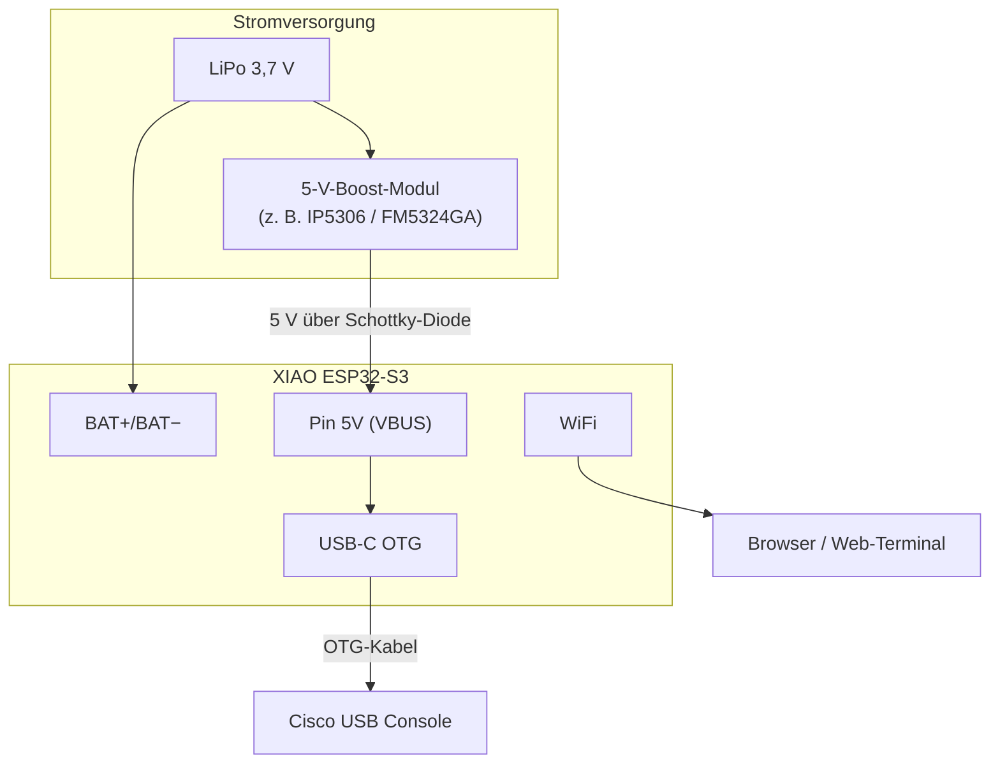

# ESP32-S3 Cisco Out-of-Band Web Console

Out-of-Band-Zugriff auf Cisco Switches (Catalyst, Nexus, IE usw.) über ein Web-Terminal im Browser.

**Kein UART, kein MAX3232, keine GPIO-Leitungen** — die serielle Konsole läuft über den **nativen USB-C OTG-Port** des ESP32-S3 (wenn USB OTG in den Einstellungen aktiviert ist).


## Architektur

```
Browser  ←WebSocket/HTTP→  ESP32-S3 (WiFi STA oder W5500 ETH)   ←USB-C OTG (Host)→  Cisco USB Console
                                     │
                            Ethernet (W5500 SPI)  ←RJ45→  LAN-Switch
```

Der ESP32-S3 arbeitet als **USB-Host** (OTG). Der Cisco Switch erscheint als **USB-Gerät** (CDC-ACM). Daten vom Switch werden per WebSocket an den Browser durchgereicht, Tastatureingaben gehen den gleichen Weg zurück.

### Netzwerk-Priorität (ETH ↔ WiFi)

| Situation | Verhalten |
|-----------|-----------|
| Nur WiFi verbunden | Web-Terminal über WLAN-IP erreichbar |
| ETH erhält DHCP-IP | **Ethernet wird bevorzugt** (Default-Route), **WLAN-STA wird ausgeschaltet** (Strom sparen) |
| ETH-Link oder DHCP-IP verloren | WLAN-STA wird automatisch wieder aktiviert |
| Kein WLAN nach 8 Versuchen | Fallback-AP-Modus (`192.168.4.1`) |

Das Web-Terminal startet, sobald eine Schnittstelle (WiFi, ETH oder AP) eine IP-Adresse erhält.

## W5500 SPI-Ethernet

### Anschluss W5500-Modul ↔ Seeed XIAO ESP32-S3

| W5500-Pin | XIAO-Pin | GPIO  | Funktion   |
|-----------|----------|-------|------------|
| MOSI      | D10      | GPIO9 | SPI-Daten  |
| MISO      | D9       | GPIO8 | SPI-Daten  |
| SCLK      | D8       | GPIO7 | SPI-Takt   |
| CS        | D0       | GPIO1 | Chip-Select |
| INT       | D1       | GPIO2 | Interrupt   |
| RST       | D2       | GPIO3 | Reset (opt.)|
| 3V3       | 3V3      | —     | Versorgung  |
| GND       | GND      | —     | Masse       |

> Pins `CS`, `INT` und `RST` können in `main/eth_w5500.h` über die Defines
> `W5500_CS_GPIO`, `W5500_INT_GPIO` und `W5500_RST_GPIO` angepasst werden.
> `W5500_RST_GPIO -1` bedeutet: RST nicht angeschlossen.

### Empfohlene W5500-Module

Jedes fertige **W5500-SPI-Breakout-Board** funktioniert (z. B. WIZnet W5500-EVB-Pico-HAT-Clone, WaveShare, robuste China-Breakouts).
Achte auf **3,3 V Versorgung** — das XIAO liefert nur 3,3 V am 3V3-Pin.

---

## Hardware & Anschluss

### Ziel-Board: Seeed XIAO ESP32-S3

Dieses Projekt ist für das **Seeed Studio XIAO ESP32-S3** ausgelegt (Chip: ESP32-S3R8, 8 MB Flash, 8 MB PSRAM).

| Dokument | Link |
|----------|------|
| ESP32-S3 Datasheet (Espressif) | [PDF](https://files.seeedstudio.com/wiki/SeeedStudio-XIAO-ESP32S3/res/esp32-s3_datasheet.pdf) |
| XIAO ESP32-S3 Wiki (Seeed) | [Getting Started](https://wiki.seeedstudio.com/xiao_esp32s3_getting_started/) |

Das XIAO hat **nur einen USB-C-Anschluss** — kein separater UART-Port wie am DevKitC-1. USB-Daten laufen intern über **GPIO20 (D+)** und **GPIO19 (D−)** des ESP32-S3 (Full-Speed OTG).

### Verkabelung

```
XIAO USB-C  ──OTG-Kabel/Adapter──►  Cisco USB Console (USB-A / Mini-USB)
     │
  WiFi/ETH ─┴──► Browser (http://<ip>/)
```

- Das XIAO arbeitet als **USB-Host**, der Cisco Switch als **USB-Gerät** (CDC-ACM, typ. VID `0x05f9` / PID `0x4004`)
- **OTG-Adapter** oder Kabel mit Host-Rolle nötig (USB-C → USB-A)
- **Kein** MAX3232, **kein** UART an GPIO — nur der USB-C (wenn OTG aktiviert)

### Stromversorgung & VBUS (wichtig am XIAO)

| Versorgung | Pin `5V` (VBUS) | Cisco am USB-C |
|------------|-----------------|----------------|
| USB-C am PC/Ladegerät | 5 V verfügbar | funktioniert |
| Nur LiPo-Batterie | **kein** 5 V am Pin | **extern 5 V** an Pin `5V` einspeisen |

Bei Batteriebetrieb liefert das XIAO **kein VBUS** an den Cisco-Port. Dann 5 V von außen an den **`5V`-Pin** (VBUS) legen — z. B. über ein Power-Bank-Modul. Siehe [Seeed Forum](https://forum.seeedstudio.com/t/xiao-esp32s3-as-usb-host-while-battery-powered/292637).

### Pinout (relevante Pins)

Draufsicht XIAO ESP32-S3 — nur die für dieses Projekt wichtigen Anschlüsse:

```
                    ┌─────────────────────────┐
                    │      U.FL (Antenne)     │
    USB-C ◄─────────┤  [==== XIAO ESP32-S3 ===│
                    │                         │
         5V (VBUS) ─┤ 5V                  D0  │
              GND ──┤ GND                 D1  │
              3V3 ──┤ 3V3                 ... │
                    │                         │
    UART Debug ─────┤ D6  (TX / GPIO43)  D10 │
                    │ D7  (RX / GPIO44)  D11 │
                    │                         │
    LiPo ───────────┤ BAT+ / BAT-            │
                    │  [Boot]  [Reset]        │
                    └─────────────────────────┘

    Intern (nicht an Header):  GPIO19 = USB D− , GPIO20 = USB D+
```

| XIAO-Pin | GPIO | Funktion in diesem Projekt |
|----------|------|--------------------------|
| **USB-C** | 19, 20 | Cisco-Konsole (OTG Host) **oder** Serial/JTAG (Flashen/Monitor) |
| **5V** | VBUS | 5-V-Versorgung für Cisco-USB (bei Batteriebetrieb von außen) |
| **GND** | — | Masse |
| **D6** | 43 | UART TX → optional USB-UART-Adapter für `idf.py monitor` |
| **D7** | 44 | UART RX ← optional USB-UART-Adapter |
| **BAT+ / BAT−** | — | 3,7-V-LiPo (optional, für mobilen OOB-Einsatz) |
| **Boot** | 0 | Bootloader (halten beim Reset → manuelles Flashen) |

Vollständiges Pinout: [Seeed Pinout Sheet](https://wiki.seeedstudio.com/xiao_esp32s3_getting_started/) (Abschnitt Hardware Overview).

### Schaltung: Batteriebetrieb mit Cisco USB

Am XIAO liegt am Pin `5V` bei reiner Batterieversorgung **keine Spannung** an — der Cisco-Console-Port braucht aber **5 V auf VBUS**. Lösung: 5-V-Einspeisung über den `5V`-Pin, während das XIAO selbst von der LiPo läuft.



**Verdrahtung (Batteriebetrieb):**

```
  LiPo 3,7 V
      │
      ├──► BAT+ / BAT− am XIAO          (XIAO versorgen)
      │
      └──► 5-V-Boost-Modul (Eingang)
                │
                └──► 5 V ──[ Schottky ]──► Pin 5V am XIAO
                                              │
  XIAO USB-C ──── OTG-Kabel ────────────────┴──► Cisco Console
  XIAO GND ─────────────────────────────────────► Cisco GND (über USB-Kabel)
```

**Hinweise zur Schaltung:**

| Punkt | Empfehlung |
|-------|------------|
| Schottky-Diode | Zwischen Boost-Ausgang und Pin `5V`: **Anode** → Boost, **Kathode** → `5V` (laut Seeed-Wiki bei externer Einspeisung) |
| Masse | GND von Boost, XIAO und Cisco gemeinsam |
| USB-C am PC | Beim Batteriebetrieb **nicht** gleichzeitig am PC und Cisco hängen — PHY-Konflikt, siehe unten |
| Strombedarf | Cisco-USB-Console typ. 50–100 mA; Boost-Modul mit ≥ 500 mA wählen |
| Laden | Viele Boost/Lade-Module laden die LiPo über einen eigenen USB-C-Eingang, während der Last-Ausgang das XIAO + VBUS versorgt |

**Einfachster Fall (ohne Batterie):** XIAO per USB-C am Netzteil/PC → Pin `5V` hat VBUS → Cisco direkt am selben USB-C über OTG-Adapter (**nur** wenn das Kabel/Modul Host-Rolle unterstützt; oft besser: XIAO am Netzteil, OTG-Adapter am USB-C).

### USB-PHY: ein Port, zwei Funktionen

Am ESP32-S3 teilen sich **USB Serial/JTAG** und **USB OTG** dieselbe interne PHY. Gleichzeitig Flashen/Monitor **und** Cisco-Host am selben USB-C geht nicht.

Der Modus wird über **⚙ → Netzwerk & Seriell → USB OTG** gesteuert (erfordert Neustart):

| USB OTG | USB-C-Funktion | Debug-Ausgabe |
|-------|----------------|---------------|
| **Deaktiviert** (Standard) | Serial/JTAG → PC | `idf.py flash monitor` am USB-C |
| **Aktiviert** | OTG Host → Cisco | UART über **D6/D7** (GPIO43/44) oder nur Web-UI |

**Typischer Ablauf:**

1. **Entwicklung / Flashen:** USB OTG **deaktiviert** lassen → XIAO per USB-C am PC → `idf.py flash monitor`
2. **Produktivbetrieb (Cisco OOB):** In den Einstellungen USB OTG **aktivieren** → Neustart → USB-C für Cisco reservieren
3. **Debug bei aktivem OTG:** Optional USB-UART-Adapter an D6/D7 oder Logs nur im Web-Terminal

> Ohne Neustart nach OTG-Änderung kann der ESP hängen bleiben — die Web-UI warnt entsprechend.

### Andere ESP32-S3-Boards (z. B. DevKitC-1)

Boards mit **zwei** USB-Anschlüssen: Cisco an **USB-OTG**, Flashen/Monitor am **UART/JTAG-Port** — kein Moduswechsel nötig.

## Features

- Web-Terminal mit xterm.js (dunkles Theme)
- WebSocket `/ws` für bidirektionale Konsole
- Befehlszeile unter dem Terminal (einzelne Befehle an Cisco senden)
- Break-Signal (250 ms) für ROMMON / Unterbrechung
- Baudrate: 9600 / 19200 / 38400 / 57600 / 115200
- **Settings-Drawer** (⚙-Button): WLAN, AP-Fallback, MAC-Adressen, Baudrate, OTG und WireGuard inline konfigurieren
- **USB OTG ein-/ausschaltbar** (Standard: deaktiviert — erleichtert Flashen und Serial Monitor)
- Bis zu 4 gleichzeitige WebSocket-Clients
- **W5500 SPI-Ethernet** mit automatischer ETH/WiFi-Umschaltung
- Status-Anzeige in der Web-UI: WiFi-IP, ETH-IP, aktive IP, USB- und WireGuard-Status
- **WiFi-Fallback-AP**: Kein WLAN erreichbar → automatischer Hotspot-Modus (SSID/Passwort konfigurierbar)
- **WireGuard VPN**: optionaler VPN-Tunnel zur sicheren Fernwartung
- **Deep Sleep / Ausschalten** über Web-UI (Reset-Taste zum Wieder-Einschalten)
- **MTU 1420** auf allen Netzwerkschnittstellen (WireGuard-kompatibel)

## Projektstruktur

```
esp32s3_serialweb/
├── CMakeLists.txt
├── partitions.csv          ← 2 MB App-Partition (für WireGuard + OTG)
├── sdkconfig.defaults
├── components/
│   └── trombik__esp_wireguard/   ← WireGuard-Komponente (IDF-6.0-Patches)
└── main/
    ├── CMakeLists.txt
    ├── idf_component.yml
    ├── main.c              ← HTTP-Server, WiFi, AP-Fallback, USB-Host, Events
    ├── config.c/h          ← NVS-Konfiguration (WiFi, OTG, MAC, WireGuard)
    ├── eth_w5500.c/h       ← W5500 SPI-Ethernet-Treiber + Pin-Defines
    ├── wg_client.c/h       ← WireGuard-Client
    └── web_terminal.html   ← Weboberfläche (eingebettet ins Binary)
```

## Build & Flash

```bash
cd esp32s3_serialweb
idf.py set-target esp32s3
idf.py build
idf.py flash monitor
```

Nach dem Flash:

```
http://<ip-des-esp32>/
```

## Erste Konfiguration

1. Beim ersten Start verbindet sich der ESP mit der Standard-SSID `net1` (Passwort in `config.c` oder bereits in NVS).
2. **USB OTG ist standardmäßig deaktiviert** — der USB-C-Port funktioniert als Serial/JTAG für Flashen und Monitor.
3. IP im Serial Monitor ablesen oder Router-DHCP prüfen.
4. Im Browser `http://<ip>/` öffnen → **⚙** (Settings) anklicken → Tab **Netzwerk & Seriell**:
   - WLAN-Daten eintragen
   - **USB OTG auf „Aktiviert"** setzen (für Cisco-Konsole)
   - Speichern → ESP startet automatisch neu
5. Cisco per **OTG-Kabel** an den USB-C des XIAO anschließen (XIAO = Host).

### WiFi-Fallback: AP-Modus

Wenn das konfigurierte WLAN nach **8 Verbindungsversuchen** nicht erreichbar ist, wechselt der ESP32 automatisch in den Hotspot-Modus:

| Parameter | Standardwert |
|-----------|--------------|
| **SSID** | `ESP32S3_AP` |
| **Passwort** | `DefaultPass!` |
| **IP des ESP32** | `192.168.4.1` |

SSID und Passwort des Fallback-AP sind unter **⚙ → Netzwerk & Seriell → WLAN FALLBACK-AP** anpassbar.

Im Browser `http://192.168.4.1/` öffnen → **⚙** → Tab **Netzwerk & Seriell** → neue WLAN-Daten eintragen → **Speichern**. Der ESP startet automatisch neu und verbindet sich als STA mit dem neuen Netz.

> Im Topbar wird der AP-Modus durch **⚠ AP-Modus** (gelb) angezeigt. Bei deaktiviertem OTG erscheint zusätzlich **OTG DISABLED**.

### Serial Monitor

#### Mit ESP-IDF

```bash
# Linux / macOS — USB OTG deaktiviert (Standard):
idf.py -p /dev/cu.usbmodem* monitor      # macOS
idf.py -p /dev/ttyACM0 monitor           # Linux

# Windows — USB OTG deaktiviert (Standard):
idf.py -p COM7 monitor

# USB OTG aktiviert (Cisco am USB-C): Monitor über UART an D6/D7:
idf.py -p /dev/cu.usbserial* monitor     # macOS
idf.py -p COM3 monitor                   # Windows (USB-UART-Adapter)
```

Monitor-Baudrate: **115200** (siehe `sdkconfig` → `CONFIG_ESPTOOLPY_MONITOR_BAUD`).

#### Ohne ESP-IDF (Windows, PowerShell)

Wenn `idf.py` nicht verfügbar ist, reicht ein einfacher Serial-Monitor über .NET:

```powershell
$port = New-Object System.IO.Ports.SerialPort COM7,115200,None,8,one
$port.ReadTimeout = 500
$port.Open()
Write-Host "Serial Monitor COM7 @ 115200 — Ctrl+C zum Beenden"
while ($true) {
    try { $d = $port.ReadExisting(); if ($d) { Write-Host -NoNewline $d } } catch {}
    Start-Sleep -Milliseconds 50
}
```

> COM-Port im Geräte-Manager prüfen (`Serielles USB-Gerät`). Intel AMT/COM-Ports ignorieren.

## API

| Endpoint | Methode | Beschreibung |
|----------|---------|--------------|
| `/` | GET | Web-Terminal (HTML) |
| `/ws` | GET | WebSocket Konsole |
| `/status` | GET | JSON: `ip`, `eth_ip`, `active_ip`, `wg_ip`, `wg_up`, `baud`, `usb`, `ap`, `otg_en` |
| `/break` | POST | Break-Signal senden |
| `/baud` | POST | Baudrate setzen (Body: Zahl als Text) |
| `/config` | POST | Netzwerk/OTG/MAC/Baud speichern; `{"ok":true}` oder `{"ok":true,"rebooting":true}` |
| `/config-json` | GET | Aktuelle Konfig als JSON (kein WLAN-Passwort) |
| `/wg` | POST | WireGuard-Konfig speichern + Tunnel neu starten |
| `/wg-json` | GET | Aktuelle WireGuard-Konfig als JSON (kein Privkey) |
| `/reboot` | POST | ESP neu starten |
| `/shutdown` | POST | ESP in Deep Sleep (Reset-Taste zum Einschalten) |

### `/config` POST-Felder (URL-encoded)

| Feld | Beschreibung |
|------|--------------|
| `ssid` | WLAN-SSID |
| `password` | WLAN-Passwort (leer = unverändert) |
| `baud` | Baudrate |
| `otg_en` | `1` = USB OTG aktiv, `0` = deaktiviert (Neustart nötig) |
| `ap_ssid` | Fallback-AP-SSID |
| `ap_pass` | Fallback-AP-Passwort (leer = unverändert) |
| `wifi_mac` | WLAN-MAC `XX:XX:XX:XX:XX:XX` (leer = Auto/eFuse, Neustart nötig) |
| `eth_mac` | LAN-MAC `XX:XX:XX:XX:XX:XX` (leer = Auto/eFuse, Neustart nötig) |

### WireGuard VPN

Der ESP32 kann optional einen WireGuard-Tunnel zu einem VPN-Server aufbauen, um auch über das öffentliche Internet sicher erreichbar zu sein.

Konfiguration unter **⚙ → WireGuard VPN**:

| Feld | Beschreibung |
|------|-------------|
| **Aktiviert** | Tunnel ein-/ausschalten |
| **Privater Schlüssel (ESP32)** | Base64-codierter privater Schlüssel des ESP32 |
| **ESP32 Public Key** | Anzeige des öffentlichen Schlüssels (für die Server-Konfiguration) |
| **Server Public Key** | Öffentlicher Schlüssel des WireGuard-Servers |
| **Server Endpoint** | IP oder Hostname des Servers |
| **Port** | UDP-Port (Standard: 51820) |
| **VPN-IP (ESP32)** | Adresse des ESP32 im VPN-Netz (z. B. `10.8.0.3`) |
| **Subnetzmaske** | Maske des VPN-Netzes (z. B. `255.255.255.0`) |
| **Keepalive** | Sekunden zwischen Keep-Alive-Paketen (Standard: 25) |

**Server-seitige Peer-Konfiguration (Beispiel):**

```ini
[Peer]
PublicKey = YEcZ19DyakGAOoBD6u8RRwre8phDfjNt2cbAG84I+xk=
AllowedIPs = 10.8.0.3/32
PersistentKeepalive = 25
```

**Hinweise:**

- Der ESP32 synchronisiert die Systemzeit via **SNTP (NTP)** bevor WireGuard startet. Das ist notwendig, da WireGuard TAI64N-Timestamps in Handshake-Paketen verwendet — ohne korrekte Uhrzeit verwirft der Server die Initiierung (Replay-Schutz).
- Bei Schnittstellenwechsel (ETH ↔ WiFi) wird WireGuard automatisch neu gestartet.
- Der WireGuard-Status (`VPN-IP ✓` oder `…`) wird in der Statusleiste angezeigt.
- Komponente: [`trombik/esp_wireguard`](https://github.com/trombik/esp_wireguard) (lokal in `components/` für IDF-6.0-Patches).

## Anforderungen

- ESP-IDF 6.0 (getestet mit 6.0.1)
- ESP32-S3 als Target
- Management-Netz ohne Web-Auth (keine Login-Seite — nur im vertrauenswürdigen Netz einsetzen)

## Lizenz

Eigenes Projekt — frei verwendbar.
